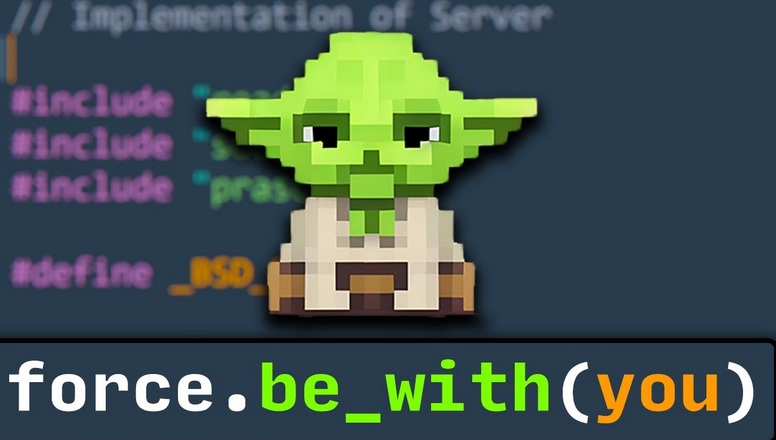

[](https://classroom.github.com/a/8zmCNbVE)
[](https://classroom.github.com/online_ide?assignment_repo_id=12789603&assignment_repo_type=AssignmentRepo)
# bibliofriki
Que la fuerza os acompañe.



# Curiosidades PostExamen
  En la carpeta data/generate, encontrareis un script de python que ha generado la metadata y ha descargado las imagenes del API de Google Books pasandole una lista de titulos que queria buscar. Que lo disfrutéis.
  Para lanzarlo, a parte de tener conexión a internet, deberemos lanzarlo de la siguiente forma:

````
python3 getmetadata.py isbns.txt tittle.txt --apikey TUAPIKEY
````
  Para la ApiKey, deberéis ir al google console y crear un proyecto, activar la api de google books y en credenciales, obtener la apikey.

# Pregunta 8
No he creado ningún componente, sin embargo ha sido por la falta de tiempo. Aunque tenga manejo con los componentes, los imports me siguen dando algún que otro fallo y no quería perder tiempo en ello, sino que quería priorizar tener más cosas hechas.
Aun así, se podrían haber hecho varios componentes, como los ion-items para mostrar los detalles de los libros (que se usan tanto en catalogoPage como en MisPrestamosPage), por ejemplo.
Creo que mi decisión ha sido la correcta para no perder tiempo en el examen y poder abarcarlo todo (tal y como he hecho)

Que la fuerza te acompañe recogiendo (y con cariño, que es mi cumple el dia del examen)
